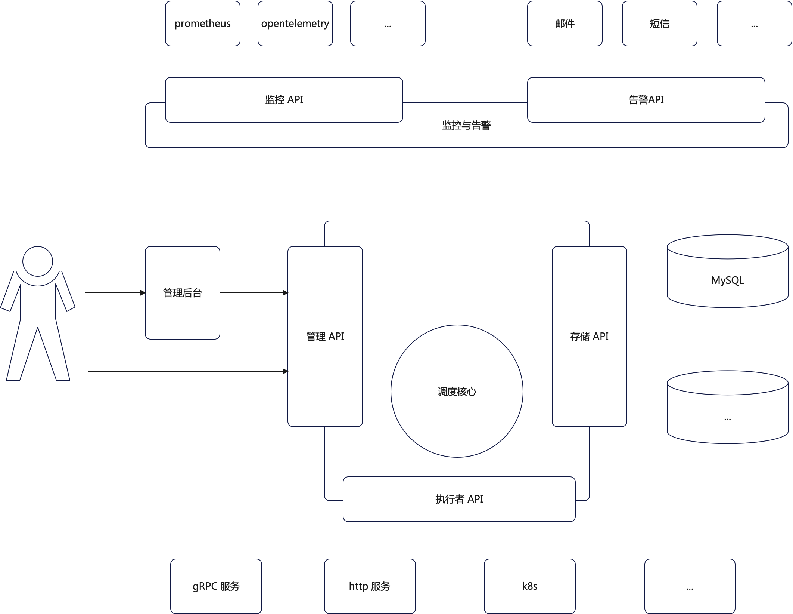

# 架构设计

目前来看，整体上可以分成几个核心部分：
- 管理 API。它是用于任务自身的管理，例如创建、编辑或者修改之类的。我们会基于这个管理 API 提供一个管理后台，但是同时用户也可以构建自己的管理后台，或者直接在代码里面编程式地创建任务或者管理任务。所以这个 API 强调的是简单、通用；
- 管理后台：基于管理 API 构建的一个可视化管理后台。该管理后台能够暴露接口，以允许用户接入 SSO 和权限控制等必备模块。与此同时，该管理后台与用户自己写的管理后台应该是具有平等地位的，也就是意味着管理 API 的每一个 API 都是通用的，不能针对这个默认的管理后台做任何假设；
- 调度核心：它需要解决一下问题：
  - 广播、组播和单播调度的问题
  - 重试
  - 任务编排：即在前置任务成功之后才能调用后续任务。也要考虑前置任务有必选、可选的区别；
  - 资源控制：能够控制在特性范围内的资源消耗，例如某个组，某个部门或者某个项目内部的资源消耗；
- 监控和告警：提供通用的 API，以允许用户接入各种监控。prometheus 和 opentelemetry 作为默认的实现，和用户的自定义实现地位是平等的，即 API 不能针对默认实现做任何假设。告警也是类似。本质上可以认为我们需要在整个系统里面设计一整套的埋点监控的方案；

此外，出于安全性的考虑。任何涉及网络调用过程的组件之间的通信，必须设计完整的身份认证和权限控制机制。