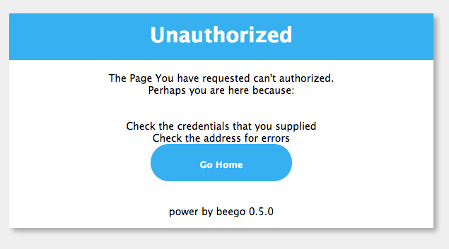

# Error Handling

When we do web development, we often need page jumping and error handling, and Beego has taken this into account, using the `Redirect` method for redirecting:

```go
func (this *AddController) Get() {
	this.Redirect("/", 302)
}
```

To abort the request and throw an exception, Beego can do this in the controller:

```go
func (this *MainController) Get() {
	this.Abort("401")
	v := this.GetSession("asta")
	if v == nil {
		this.SetSession("asta", int(1))
		this.Data["Email"] = 0
	} else {
		this.SetSession("asta", v.(int)+1)
		this.Data["Email"] = v.(int)
	}
	this.TplName = "index.tpl"
}
```

So that the code after `this.Abort("401")` will not be executed and the following page will be displayed to the user by default:



The web framework supports 401, 403, 404, 500, 503 error handling by default. Users can customize the corresponding error handling, for example, the following redefines the 404 page:

```go
func page_not_found(rw http.ResponseWriter, r *http.Request){
	t,_:= template.New("404.html").ParseFiles(web.BConfig.WebConfig.ViewsPath+"/404.html")
	data :=make(map[string]interface{})
	data["content"] = "page not found"
	t.Execute(rw, data)
}

func main() {
	web.ErrorHandler("404",page_not_found)
	web.Router("/", &controllers.MainController{})
	web.Run()
}
```

We can handle 404 errors by customizing the error page `404.html`.

Another more user-friendly aspect of Beego is its support for user-defined string error type handling functions, such as the following code, where the user registers a database error handling page:

```go
func dbError(rw http.ResponseWriter, r *http.Request){
	t,_:= template.New("dberror.html").ParseFiles(web.BConfig.WebConfig.ViewsPath+"/dberror.html")
	data :=make(map[string]interface{})
	data["content"] = "database is now down"
	t.Execute(rw, data)
}

func main() {
	web.ErrorHandler("dbError",dbError)
	web.Router("/", &controllers.MainController{})
	web.Run()
}
```

Once you register this error handling code in the entry, then you can call `this.Abort("dbError")` for exception page handling whenever you encounter a database error in your logic.

## Controller define Error
Beego version 1.4.3 added support for Controller defined Error handlers, so we can use the `web.Controller` and `template.Render` context functions

```go

package controllers

import (
	"github.com/beego/beego/v2/server/web"
)

type ErrorController struct {
	web.Controller
}

func (c *ErrorController) Error404() {
	c.Data["content"] = "page not found"
	c.TplName = "404.tpl"
}

func (c *ErrorController) Error500() {
	c.Data["content"] = "internal server error"
	c.TplName = "500.tpl"
}

func (c *ErrorController) ErrorDb() {
	c.Data["content"] = "database is now down"
	c.TplName = "dberror.tpl"
}
```
From the example we can see that all the error handling functions have the prefix `Error`，the other string is the name of `Abort`，like `Error404` match `Abort("404")`

Use `web.ErrorController` to register the error controller before `web.Run`

```go
package main

import (
	_ "btest/routers"
	"btest/controllers"

	"github.com/beego/beego/v2/server/web"
)

func main() {
	web.ErrorController(&controllers.ErrorController{})
	web.Run()
}

```


## Panic Handling

If you want the user to be able to return a response even if a panic occurs while the server is processing the request, then you can use Beego's recovery mechanism. This mechanism is enabled by default.

```go
web.BConfig.RecoverPanic = true
```

If you want to customize the processing behavior after `panic`, then you can reset `web.BConfig.RecoverFunc`:

```go
	web.BConfig.RecoverFunc = func(context *context.Context, config *web.Config) {
		if err := recover(); err != nil {
			context.WriteString(fmt.Sprintf("you panic, err: %v", err))
		}
	}
```

Always be careful: you always need to detect the result of `recover` and put the logic for recovering from `panic` inside the code that detects that `recover` does not return `nil`.

## Reference

-[Controller API - Interrupt](../router/ctrl_style/controller.md)
